# LibSurgeon 🔬

**Static Library & ELF Dissector - Automated Reverse Engineering with Ghidra**

LibSurgeon is a powerful automated tool that performs surgical extraction of C/C++ source code from static library archives and ELF binaries. It leverages Ghidra's advanced decompilation engine to reconstruct readable source code from compiled binaries.

## Supported File Types

| Type | Extensions | Processing Method |
|------|------------|-------------------|
| **Archives** | `.a`, `.lib` | Extract `.o` files, then decompile each |
| **ELF Files** | `.so`, `.elf`, `.axf`, `.out`, `.o` | Direct decompilation with module grouping |

## Features

- 🔍 **Unified Processing**: One command processes ALL supported file types in a directory
- 🔄 **Recursive Scanning**: Automatically finds all supported files in subdirectories
- ⚡ **Parallel Processing**: Multi-threaded decompilation with configurable job count
- 📊 **Progress Tracking**: Real-time progress display with ETA estimation
- 📁 **Organized Output**: Clean directory structure with sources, headers, and logs
- 🧩 **Module Grouping**: Smart function grouping by prefix, alphabet, or CamelCase patterns
- 🎯 **Flexible Filtering**: Include/exclude patterns work across all file types
- 📝 **Documentation**: Auto-generated README and summary reports

## How It Works

### Static Library Pipeline (.a files)

```mermaid
flowchart LR
    A["📦 .a Archive<br/>(input)"] --> B["📂 Extract<br/>.o files"]
    B --> C["🔬 Ghidra<br/>Decompile"]
    C --> D["📄 .cpp Files<br/>(output)"]
```



1. **Archive Extraction**: Uses `ar` to extract individual object files (`.o`) from the static library
2. **Symbol Analysis**: Ghidra analyzes the ELF format, identifies functions, data structures, and cross-references
3. **Decompilation**: Ghidra's decompiler translates machine code back to C/C++ pseudocode
4. **Output Generation**: Each object file produces a corresponding `.cpp` source file

### ELF File Pipeline (.elf, .axf, .out, .so)

```mermaid
flowchart LR
    A["📦 ELF File<br/>(input)"] --> B["🔍 Analyze<br/>Symbols"]
    B --> C["🧩 Group by<br/>Module"]
    C --> D["🔬 Ghidra<br/>Decompile"]
    D --> E["📄 Module .cpp<br/>(output)"]
```



1. **Symbol Analysis**: Extracts function names and identifies naming patterns
2. **Module Grouping**: Groups functions by prefix (e.g., `xxBmp*`, `xxFnt*`) or other strategies
3. **Decompilation**: Each module is decompiled to a separate `.cpp` file
4. **Index Generation**: Creates a function index with addresses for cross-referencing

> **Note**: Shared libraries (`.so`) use the same pipeline as ELF executables. They are both ELF format files.

## Requirements

- **Ghidra** 11.0 or later (with analyzeHeadless support)
- **Java** 17 or later (required by Ghidra)
- **GNU Binutils** (for `ar` command)
- **Bash** 4.0+ (for array support)
- **Optional**: GNU Parallel (for improved multi-threading)

## Installation

1. Clone or download this repository
2. Ensure scripts are executable:
   ```bash
   chmod +x libsurgeon.sh ghidra_decompile.py ghidra_decompile_elf.py
   ```
3. Install Ghidra from https://ghidra-sre.org/

## Usage

### Basic Usage - Static Libraries

```bash
./libsurgeon.sh -g /path/to/ghidra <target_directory>
```

### Basic Usage - ELF Files

```bash
./libsurgeon.sh -g /path/to/ghidra <elf_file>
```

### Basic Usage - Shared Libraries

```bash
./libsurgeon.sh -g /path/to/ghidra <shared_library.so>
```

### Options

| Option | Description |
|--------|-------------|
| `-g, --ghidra <path>` | Path to Ghidra installation (REQUIRED) |
| `-o, --output <dir>` | Output directory (default: `./libsurgeon_output`) |
| `-j, --jobs <num>` | Number of parallel jobs (default: auto) |
| `-m, --module <strategy>` | Module grouping strategy for ELF: `prefix`, `alpha`, `camelcase`, `single` |
| `-c, --clean` | Clean previous output before processing |
| `-l, --list` | List archive/ELF contents without decompiling |
| `-h, --help` | Show help message |

### Module Grouping Strategies (ELF only)

| Strategy | Description | Best For |
|----------|-------------|----------|
| `prefix` | Group by function prefix (e.g., `xxBmp*`, `GfxInit*`) | Libraries with consistent naming |
| `alpha` | Group by first letter (A-Z) | Very large ELF files |
| `camelcase` | Extract CamelCase words as module names | OOP-style code |
| `single` | All functions in one file | Small ELF files |

### Examples

```bash
# Process ALL supported files in a directory (recursive)
./libsurgeon.sh -g /opt/ghidra ./my_sdk/

# Process a single file (auto-detect type)
./libsurgeon.sh -g /opt/ghidra ./firmware.elf
./libsurgeon.sh -g /opt/ghidra ./libfoo.a
./libsurgeon.sh -g /opt/ghidra ./libbar.so

# ELF module grouping strategies
./libsurgeon.sh -g /opt/ghidra -m alpha ./firmware.elf           # Alphabetic
./libsurgeon.sh -g /opt/ghidra -m camelcase ./firmware.axf       # CamelCase
./libsurgeon.sh -g /opt/ghidra -m single ./app.out               # Single file

# Filter files (works for ALL file types)
./libsurgeon.sh -g /opt/ghidra -i "libgre*" ./sdk/               # Only libgre*
./libsurgeon.sh -g /opt/ghidra -e "*test*" ./vendor/             # Exclude tests

# List contents without decompiling
./libsurgeon.sh -g /opt/ghidra --list ./my_sdk/
```

## Output Structure

### For Static Libraries (.a)

```
libsurgeon_output/
├── library_name/
│   ├── src/              # Decompiled source (one .cpp per .o)
│   │   ├── module1.cpp
│   │   ├── module2.cpp
│   │   └── ...
│   ├── include/          # Copied original headers
│   ├── logs/             # Ghidra processing logs
│   └── README.md
└── SUMMARY.md
```

### For ELF Files

```
libsurgeon_output/
├── firmware/
│   ├── src/              # Decompiled source (grouped by module)
│   │   ├── firmware_bitmap.cpp     # Bitmap functions
│   │   ├── firmware_font.cpp       # Font functions
│   │   ├── firmware_init.cpp       # Graphics init
│   │   └── firmware_misc.cpp       # Ungrouped functions
│   ├── logs/             # Ghidra processing logs
│   ├── firmware_INDEX.md # Complete function index
│   └── README.md
└── SUMMARY.md
```

## Understanding the Output

### Module Grouping Example

For an ELF with functions like:
- `xxBmpInit`, `xxBmpOpen`, `xxBmpClose`
- `xxFntInit`, `xxFntGetMetrics`
- `GfxCreateSurface`, `GfxDestroySurface`

Using `prefix` strategy produces:
- `firmware_bmp.cpp` - All Bmp* functions
- `firmware_fnt.cpp` - All Fnt* functions  
- `firmware_GfxCreate.cpp` - GfxCreate* functions
- `firmware_GfxDestroy.cpp` - GfxDestroy* functions

### Decompiled Code Characteristics

```cpp
// Original function names are preserved (if not stripped)
void HAL_Init(void) {
    // Local variables use auto-generated names
    int local_10;
    void *param_1;
    
    // Pointer arithmetic may appear verbose
    *(int *)(param_1 + 0x10) = local_10;
    
    // Virtual calls appear as indirect function pointers
    (**(code **)(*(int *)this + 0x1c))(this);
}
```

### Tips for Analysis

1. **Start with Headers**: Original headers provide class definitions and API documentation
2. **Use the Index**: The `*_INDEX.md` file lists all functions with addresses
3. **Identify Patterns**: Look for common patterns like vtables, constructors, and destructors
4. **String References**: Search for string literals to understand functionality
5. **Cross-Reference**: Use Ghidra GUI for interactive exploration of complex code

## Customization

### Changing Target Architecture

Edit `libsurgeon.sh` to modify the processor specification:

```bash
# For different ARM variants
-processor "ARM:LE:32:Cortex"     # Cortex-M (default)
-processor "ARM:LE:32:v7"         # ARMv7
-processor "ARM:LE:32:v8"         # ARMv8 (32-bit)

# For other architectures
-processor "x86:LE:32:default"    # x86 32-bit
-processor "x86:LE:64:default"    # x86-64
-processor "MIPS:LE:32:default"   # MIPS 32-bit
```

### Ghidra Script Customization

The decompilation scripts can be modified:
- `ghidra_decompile.py` - For .a archives (per-object file output)
- `ghidra_decompile_elf.py` - For ELF files (module-grouped output)

Customization options:
- Add custom analysis passes
- Filter specific functions
- Apply custom naming conventions
- Export additional metadata
- Adjust module grouping logic

## Troubleshooting

### Common Issues

| Issue | Solution |
|-------|----------|
| "Java not found" | Install Java 17+ and ensure it's in PATH |
| "Ghidra headless not found" | Verify Ghidra path with `-g` option |
| Empty output files | Check logs for analysis errors |
| Memory issues | Reduce parallel jobs with `-j` option |
| Wrong architecture | Modify `-processor` in the script |

### Checking Logs

```bash
# For static libraries
cat libsurgeon_output/library/logs/module_ghidra.log
cat libsurgeon_output/library/logs/failed_files.txt

# For ELF files
cat libsurgeon_output/firmware/logs/ghidra_main.log
cat libsurgeon_output/firmware/logs/ghidra_script.log
```

## Technical Details

- **Target Architecture**: ARM Cortex-M (32-bit Little Endian) by default
- **Decompiler**: Ghidra's native decompiler with full analysis
- **Symbol Preservation**: Original function/variable names retained if not stripped
- **Parallel Safety**: Each object file processed in isolated Ghidra project
- **ELF Support**: Automatic detection via magic number (0x7f454c46)

## Performance Tips

- **SSD Storage**: Significantly improves I/O-bound operations
- **RAM**: Ghidra can use 2-4GB per instance; adjust `-j` accordingly
- **GNU Parallel**: Install for better job scheduling than bash background processes

## Legal Disclaimer

This tool is intended for:
- Educational purposes and learning
- Security research and vulnerability analysis
- Interoperability and compatibility testing
- Recovery of lost source code (with proper authorization)

**Please respect software licenses and intellectual property rights.**

Reverse engineering may be restricted in some jurisdictions. Ensure compliance with applicable laws and license agreements before use.

## License

MIT License - See LICENSE file for details.

## Contributing

Contributions are welcome! Please feel free to submit issues and pull requests.

---

*LibSurgeon - Precision extraction of knowledge from compiled code* 🔬
